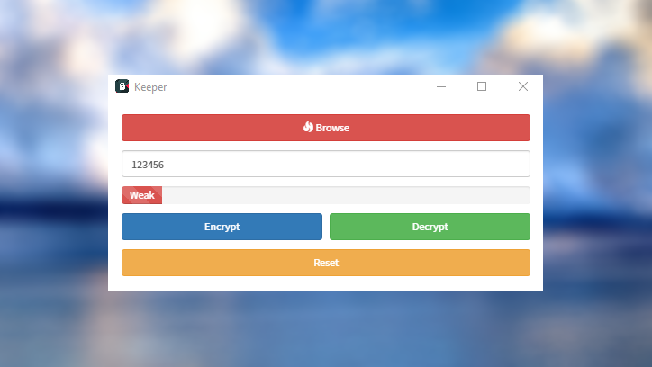

# Keeper

> Encrypts and decrypts your files with the password you specify



## Install

```sh
git clone https://github.com/ardagedikk/keeper.git
cd keeper
npm install
```

## Run

```sh
npm start
```

## Build

Build the application for specified or all platform:

```sh
npm run build-osx
npm run build-linux
npm run build-win32

npm run build
```


## License

MIT
